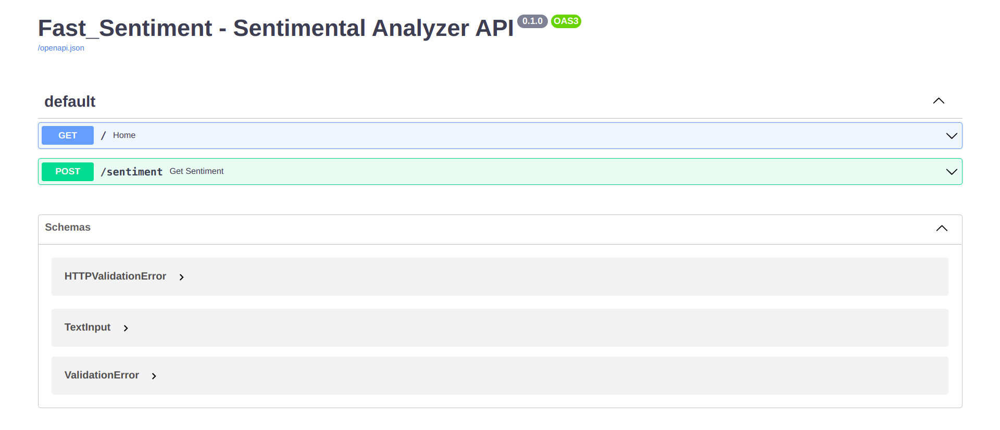

# Fast_Sentiment

> Sentimental Analysis API build with VADERSentiment, FastAPI and Docker 

## To run the API 

1. Make sure Docker is installed on your system

2. run the command `sudo docker build -t fast_sentiment .` to build the container 

3. Now run the command `sudo docker run -p 8000:8000  -t -i  fast_sentiment`. to run the API.

4. Visit `http://localhost:8000/docs` to interact with the API

## License

This project is license under the MIT License